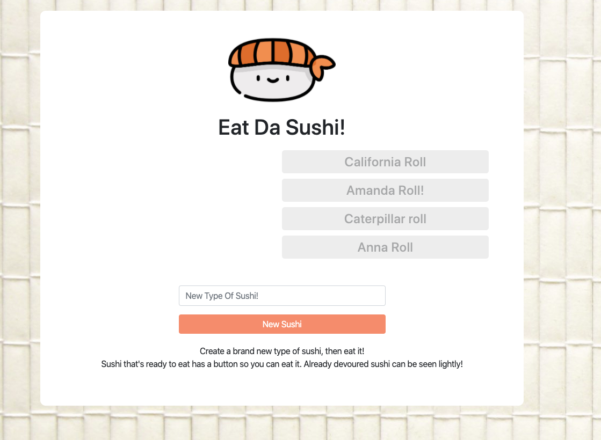

# Eat Da Sushi
 

## Description

Eat the sushi! Useless app that allows you to create sushi type and then eat them! This a full stack app using SQL, express, JavaScript, CSS, HTML, and Handlebars!

## Table Of Contents

* [Demo](#Demo)

* [Usage](#Usage)

* [License](#License)

* [Contributing](#Contributing)

* [Tests](#Tests)

* [Questions](#Questions)

## Demo
Check out the site here: 

## License
This project is licensed under: MIT

## Contributing 
Make sure to leave a detailed description in your pull request

## Questions

Contact me at d.macias.apps@gmail.com if you have any questions about my project!
